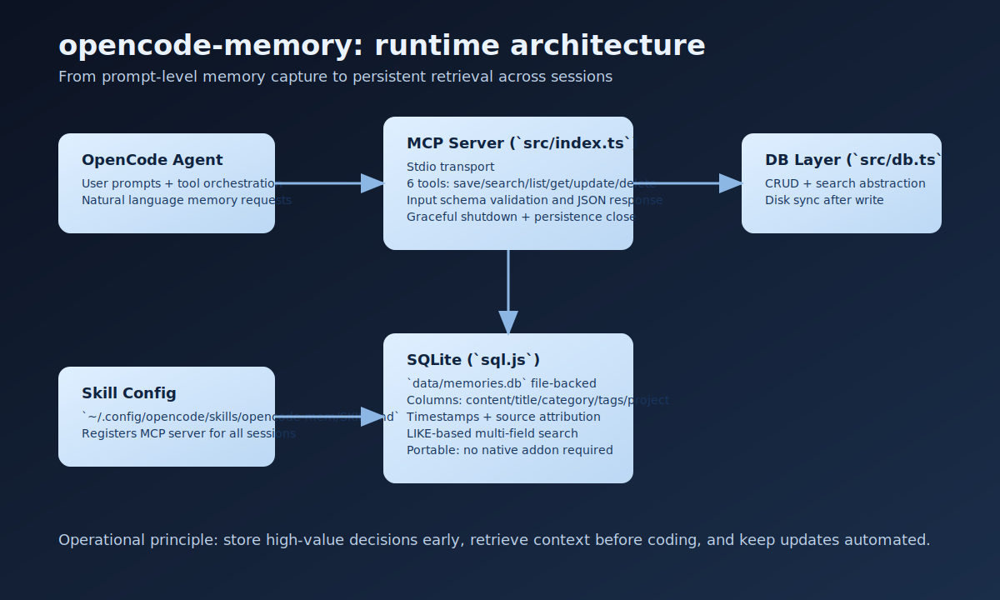
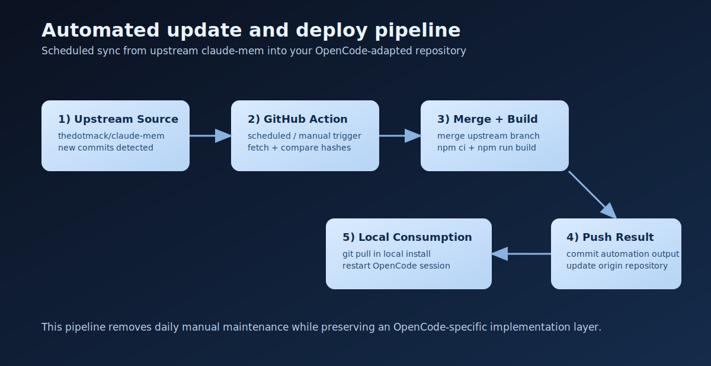

# opencode-memory

<p align="center">
  
</p>

Persistent memory infrastructure for OpenCode sessions: fast, local-first, and production-friendly.

## Why This Repository Exists

`claude-mem` is designed for Claude Code hooks. OpenCode has a different runtime model, so this project provides an OpenCode-native implementation while preserving the same core goal: memory that survives across sessions.

## Highlights

- OpenCode-native MCP server over stdio
- SQLite persistence via `sql.js` (no native binary dependency)
- Seven memory tools for CRUD + search + timeline
- Update automation (`scripts/update.sh`, `scripts/update.bat`, GitHub Actions)
- Premium docs with architecture and operations visuals

## Visual Architecture

<p align="center">
  
</p>

<p align="center">
  
</p>

## Modern Repository Structure

```text
opencode-memory/
  .github/
    workflows/
      auto-update.yml
  assets/
    diagrams/
      architecture.svg
      hero.svg
      update-flow.svg
  docs/
    architecture.md
    edition-differences.md
    getting-started.md
    operations.md
    parity-matrix.md
  src/
    constants/
      tool-definitions.ts
    handlers/
      tool-router.ts
    servers/
      mcp-server.ts
    utils/
      tool-response.ts
      validation.ts
    db.ts
    index.ts
    sql.js.d.ts
    types.ts
  CHANGELOG.md
  CONTRIBUTING.md
  scripts/
    update.bat
    update.sh
  .gitignore
  package.json
  README.md
  tsconfig.json
  update.bat          # compatibility wrapper
  update.sh           # compatibility wrapper
```

## Quick Start

1. Install dependencies and build:

```bash
npm install
npm run build
```

2. Register the skill in OpenCode:

`~/.config/opencode/skills/opencode-mem/SKILL.md`

```md
---
name: opencode-mem
description: Persistent memory for OpenCode.
mcp:
  opencode-mem:
    type: stdio
    command: node
    args:
      - C:/Users/WINDOWS 10/.gemini/antigravity/opencode-mem/build/index.js
---
```

3. Restart OpenCode.

## MCP Tools

| Tool | Purpose |
| --- | --- |
| `save_memory` | Create memory entries |
| `search_memories` | Search content/title/category/tags |
| `list_memories` | Paginated memory listing |
| `timeline_memories` | Chronological history with optional date range filters |
| `get_memory` | Fetch single memory by id |
| `update_memory` | Patch memory fields |
| `delete_memory` | Remove memory entries |

Privacy controls:

- `visibility`: `private`, `internal`, `shareable` (set on save/update)
- Read tools default to excluding private records unless `include_private=true`

## Usage Examples

- Save context: "Save memory that billing module now uses retry backoff"
- Search context: "Search memories about billing retry"
- Timeline view: "Show timeline memories for project PromptForge from 2026-02-01 00:00:00"

Manual tool call example:

```javascript
skill_mcp(
  mcp_name="opencode-mem",
  tool_name="timeline_memories",
  arguments={
    project: "PromptForge",
    from: "2026-02-01 00:00:00",
    to: "2026-02-22 23:59:59",
    limit: 20,
    offset: 0,
  }
)
```

Example response:

```json
{
  "count": 2,
  "memories": [
    {
      "id": 41,
      "title": "Retry backoff rollout",
      "project": "PromptForge",
      "category": "architecture",
      "created_at": "2026-02-20 09:11:02"
    },
    {
      "id": 42,
      "title": "Billing timeout patch",
      "project": "PromptForge",
      "category": "bugfix",
      "created_at": "2026-02-21 14:26:18"
    }
  ]
}
```

## Auto Update Paths

- Manual one-shot:
  - Windows: `update.bat auto`
  - Bash: `./update.sh --auto`
- Scheduled automation: `.github/workflows/auto-update.yml`

## Documentation

- Architecture: `docs/architecture.md`
- Edition differences from upstream: `docs/edition-differences.md`
- Getting Started: `docs/getting-started.md`
- Operations and Update Strategy: `docs/operations.md`
- Feature parity matrix: `docs/parity-matrix.md`
- Feature parity matrix v2 (release roadmap): `docs/parity-matrix-v2.md`
- Contributing guide: `CONTRIBUTING.md`
- Changelog: `CHANGELOG.md`

## License

AGPL-3.0
